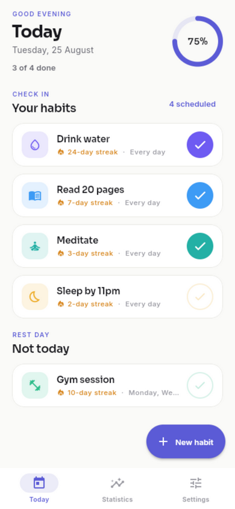
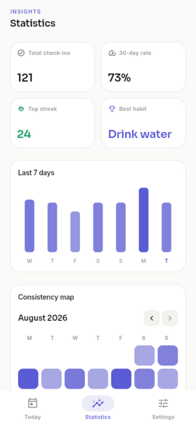
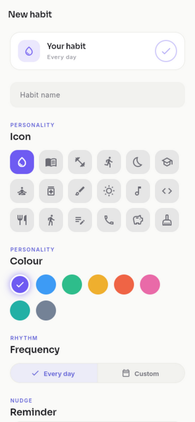
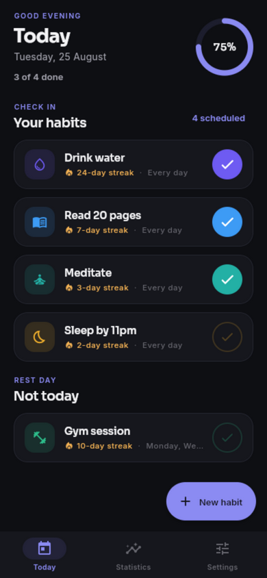
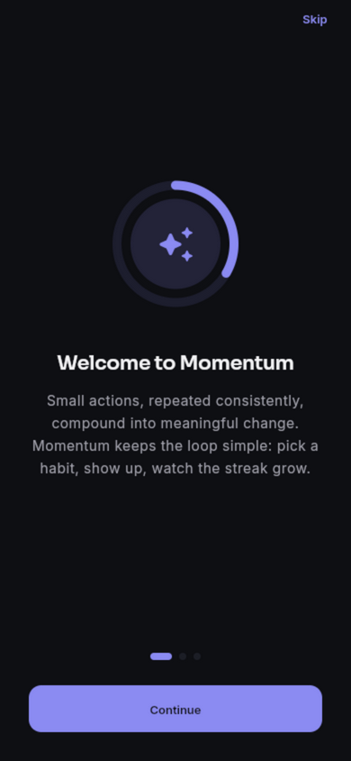
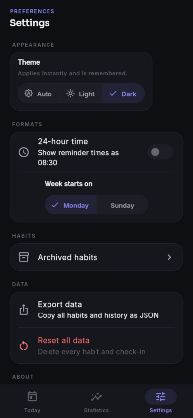

# Momentum

A clean, motivating habit tracker that turns small daily actions into lasting streaks. Built with Flutter as a semester project, demonstrating multi-screen navigation, forms with validation, Provider state management, SharedPreferences persistence, and a library of custom reusable widgets.

Momentum is intentionally offline-first: no accounts, no servers, no tracking. Everything you track lives on your device.

| Today | Statistics |
|:---:|:---:|
|  |  |

| New habit | Dark mode |
|:---:|:---:|
|  |  |

| Onboarding | Settings |
|:---:|:---:|
|  |  |

## Features

- **Habit management** — create, edit, archive, and delete habits with a name, icon, colour, and target frequency; validated form with duplicate-name detection and a live preview card.
- **Daily check-in** — a today-focused home screen where one tap marks a habit complete, with a rest-day section for habits not scheduled today.
- **Streak tracking** — current and longest streaks per habit, computed on scheduled days only. A single missed day is bridged automatically, so one slip never erases a month of progress.
- **Progress visualisation** — animated completion rings, a 7-day bar chart, and a month heatmap, all drawn with custom `CustomPainter` implementations.
- **Statistics dashboard** — total check-ins, 30-day completion rate, top streak, best habit, and per-habit 30-day rings.
- **Reminders** — optional per-habit daily local notifications with a user-chosen time.
- **Light and dark themes** — a fully designed dark mode, persisted and applied app-wide through a theme controller.
- **Onboarding and settings** — a three-page first-launch flow, 12/24-hour time format, week-start day, archived-habit restore, JSON data export, and a full data reset.
- **Offline-first persistence** — habits, check-in history, and preferences survive app restarts via SharedPreferences.

## Course concept coverage

| Concept | Where it appears |
|---|---|
| Multi-screen navigation | Named routes with a fade transition builder and a bottom navigation bar across Today, Statistics, and Settings |
| Forms and validation | Add/Edit habit validates name length, duplicate names, and frequency selection before saving |
| Provider state management | `HabitProvider` for habits and check-ins, `ThemeProvider` for the theme mode, `SettingsProvider` for preferences |
| SharedPreferences | Habits, completion history, theme choice, and onboarding state persist across restarts |
| Custom reusable widgets | `StreakRing`, `WeekBarChart`, `MonthHeatmap`, `HabitCard`, `SectionHeader`, `CheckRingButton`, `HabitIconChip` |
| Lists and scroll views | `ListView` for the habit list, `CustomScrollView` with slivers for the statistics dashboard, `GridView` for the heatmap |

## Architecture

The codebase separates the UI layer, the state layer, and the data layer:

```
momentum/
├── pubspec.yaml
└── lib/
    ├── main.dart              app entry point
    ├── preview.dart           demo entry point with seeded sample data
    ├── app.dart               MaterialApp, theme wiring, routing
    ├── core/
    │   ├── constants/         spacing, radii, motion durations and curves
    │   ├── theme/             palettes, typography, light/dark theme builders
    │   └── utils/             date helpers, id generation
    ├── data/
    │   ├── logic/streak_engine    pure streak and completion-rate algorithms
    │   ├── models/                Habit model and curated icon catalog
    │   └── services/              persistence and notification scheduling
    ├── state/
    │   ├── habits_provider    CRUD, check-ins, derived statistics
    │   ├── theme_provider     persisted theme mode
    │   └── settings_provider  time format, week start, onboarding flag
    └── ui/
        ├── onboarding/        first-launch flow
        ├── home/              today screen, habit cards, header ring
        ├── habit_form/        add/edit form with pickers
        ├── statistics/        dashboard, bar chart, heatmap
        ├── settings/          preferences, archive, export, reset
        ├── navigation/        route table
        └── widgets/           shared custom widgets
```

The streak engine is a set of pure functions with no framework dependencies, fully covered by unit tests. Notification scheduling sits behind a `NotificationScheduler` interface, with a no-op implementation used on the web and in tests.

## Getting started

Requires the [Flutter SDK](https://docs.flutter.dev/get-started/install) (3.24 or newer).

```bash
cd momentum
flutter pub get
```

Run on a connected Android device or emulator:

```bash
flutter run
```

Run in Chrome for quick iteration:

```bash
flutter run -d chrome
```

A demo entrypoint seeds five sample habits with weeks of check-in history, useful for exploring the statistics screens without waiting:

```bash
flutter run -t lib/preview.dart -d chrome
```

Local notifications are only supported on Android and iOS; on the web, reminders are skipped and everything else works as usual.

## Testing

```bash
flutter test
```

The suite covers the streak algorithm (bridged grace days, scheduled-day handling, longest-run detection), persistence round-trips, notification scheduling wiring, and end-to-end widget flows from onboarding through creating and checking in a habit.

## Building

```bash
flutter build apk --release
```

The release APK is written to `build/app/outputs/flutter-apk/app-release.apk`. Use `--split-per-abi` for smaller per-architecture builds.
